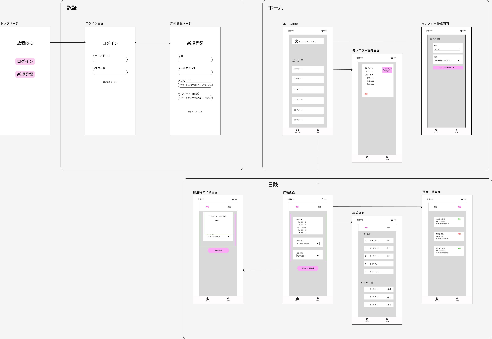
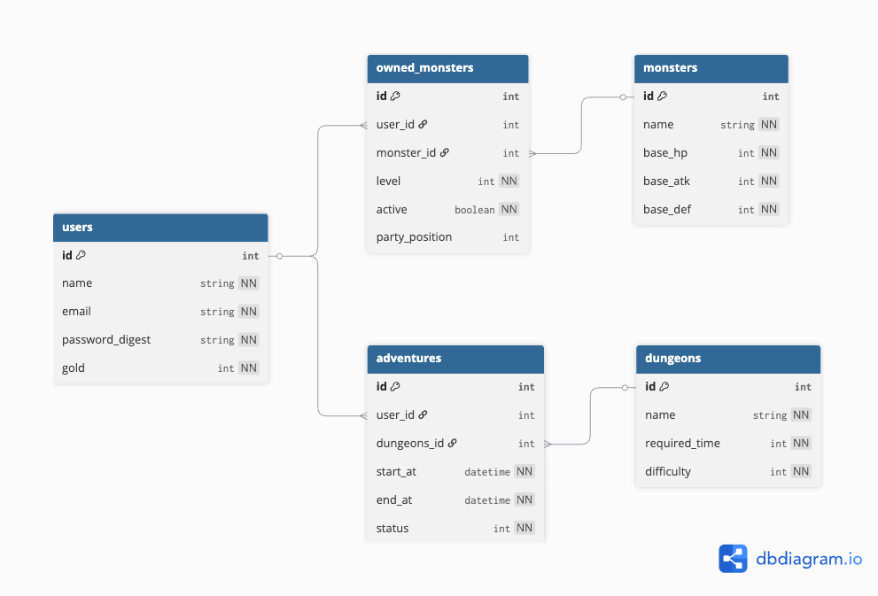
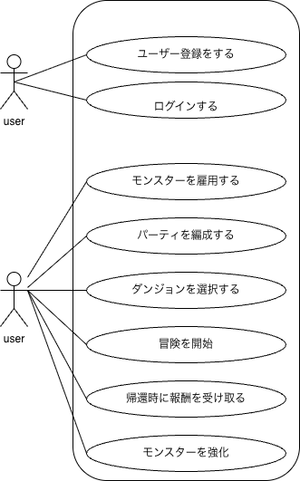

# ポモクエ（仮）

## アプリを作った理由

### 自己表現のため

  私は自己紹介文を書いていません。なぜなら紹介できるだけの過去を持っていないからです。
  
  しかし、カリキュラムにある「アプリ開発＝自分を表現するもの」という言葉を真とするのであれば、過去をうまく言語化できない私にもアプリを通じて自分を知ってもらえるかもしれないと思い、ミニアプリを作成することを決めました。
  
### なぜゲームなのか

  全~~ニート~~ゲーム好きなら一度は夢見るゲーム開発。しかしながら10年前の自分はC++と数学を前に挫折してしまいました。
  
  ただ、今ではAIを活用することでそのハードルは大きく下がっていると感じたので、卒業制作前にその夢を叶えておこうと思いゲームを選択しました。
  
### 放置ゲームを選択した理由

#### 1. このジャンルを知ってほしい

* ガチャ
* デイリークエスト
* 戦闘をオートにして放置

以上のようなスマホゲームによくある退屈な要素が無く、パーティ編成や装備の構成、トライアンドエラー、ドロップ率との戦いなど、ゲームの面白い部分に集中できる面白さがあります(やっていることはPDCAなのでエンジニア向け？)。

が、周りにやっている人が誰もいなかったので知名度を上げたい！

#### 2. Rails + JavaScriptで作れそうだと思った

テキストベースのゲームなので物理演算やキーボード操作などがなく、タイマー処理とログさえなんとかすればカリキュラムで学んだことを活かして作成可能だと思いました。

## 参考(推し)アプリの紹介

### 「ギルド物語2」

#### 良いところ

##### キャラクター作成が面白い

  種族・職業・個性を組み合わせて理想のキャラクターを作れます。 
  壁役はドワーフ戦士にして攻撃役は猫狩人にしよう...などと考えているだけで時間が溶けます。 
  転職システムもあるので、キャラメイクだけで無限に楽しめます。
  
##### 絶妙な難易度

  序盤はサクサク進みますが、中盤以降は全滅してからパーティを考えるのが基本になります。 
  敵の構成や攻撃方法、弱点を把握して攻略する必要があるので、適当にやっていてはクリアできない難易度になっています。
  
##### アイテム収集

  このゲームのモチベーションにつながる要素です。 
  何も得られずにストレスを感じることも多いですが、レアアイテムが手に入ると気分の良い1日を送ることができます。
  
##### 壮大なストーリー

  おまけに思われるかもしれませんが、ストーリーも面白いです。 
  冒険中に暇潰しとして読んでいたら、帰還していることを忘れて熱中していたこともあります。
##### 準備画面のUIが良い

  パーティの状態とリアルタイムログがコンパクトにまとまっていて、今何が起きているのかを把握しやすいです。 
  体力減少時にキャラクターの色が変わる工夫は、ユーザーに「ピンチだから撤退させるか？」という選択肢を与える要素になっているので、UXも考えられた作りになっています。

---

#### 惜しいところ

##### 課金前提の難易度

  序盤は三種の神器をパーティ分集めることが重要なのですが、無課金だと冒険時間が長くドロップ率もかなり渋いので飽きる原因になりやすいです。 
  最低でも3000円の課金は必要になります。
  
##### 情報収集が必要になる

  種族・職業・個性以外にも細かい仕様(例：行動率、アイテム所持数など)が多いので、wikiや個人ブログで情報を得ながらシステムを覚えていく必要があります。
  
##### パーティの固定化

  ダンジョンを攻略するだけなら自由にパーティを組めますが、そのダンジョンのレアアイテムを手に入れるためにはパーティを最適化する必要があります。 
  つまり、レア倍率を上げるキャラクターをパーティに入れなければならなくなり、最終的にはどのパーティも似たような構成になります。
  
##### 特殊ボスとは1日に一回しか戦えない

  １体ならまだいいのですが複数体存在するため、デイリー周回に該当すると考えマイナスポイントとさせていただきます。

## 差別化はどうするか

#### 探索時間の固定化

  冒険時間を25分・60分・90分などに固定化することで、帰還時間がイメージしやすくなりアプリに戻ってもらいやすくする。

#### 直感的にわかりやすい仕様を目指す

  * 職業・個性の部分を種族に統一することでキャラクター作成時の複雑さを排除する。
  * 素早さが高い方が先に動くなど、戦闘時の仕様も調整する。

## できること（機能一覧）

- モンスターの雇用
- モンスターの強化
- パーティの編成
- 冒険の実行
- 帰還時の処理
- ログイン・ユーザー管理

## 技術スタック

- Ruby 
- Ruby on Rails 
- PostgreSQL 
- Hotwire: Turbo / Stimulus
- Tailwind CSS 
- Docker (開発環境)
- Render (デプロイ)

## 今後の改善ポイント

- 待機中のリアルタイムログの実装
- キャラクターの画像
- キャラクター作成時にステータスを表示
- アイテムの実装
- 戦闘システムの拡張
- ダンジョン詳細

## デプロイ

- Render / Heroku などで公開
- URL: https://example.com

## 画面遷移図

## ER図

## ユースケース図

## MVP実装機能リスト
- [ ] トップページ
- [ ] 認証機能
	- [ ] 新規登録
	- [ ] ログイン
	- [ ] ログアウト
- [ ] ヘッダー
	- [ ] 所持goldを表示
- [ ] 下ナビ
	- [ ] ホーム
	- [ ] 冒険
- [ ] ホーム
	- [ ] モンスター一覧画面
		- [ ] ユーザーが所持するモンスターの一覧が表示
		- [ ] 作成画面へのリンク
		- [ ] 詳細画面へのリンク
	- [ ] モンスター詳細画面
		- [ ] 名前・レベル・ステータスを表示
		- [ ] 解雇ボタン
		- [ ] レベルアップボタン
	- [ ] モンスター雇用画面
		- [ ] 名前入力欄
		- [ ] 種族選択(ドロップダウン)
			- [ ] 「名前：必要gold」の形式で表示
		- [ ] 雇用ボタン
			- [ ] 名前または種族が空の場合はボタンを押せない
- [ ] 冒険
	- [ ] 上ナビ
		- [ ] 作戦
		- [ ] 履歴
	- [ ] 作戦画面
		- [ ] パーティの表示と編成画面のリンク
			- [ ] パーティはテキストで表示
		- [ ] ダンジョン選択(ドロップダウン)
		- [ ] ボタン
			- [ ] 状態に応じたテキスト変更
				- [ ] 待機：「冒険する」
				- [ ] 冒険中：「冒険中」
				- [ ] 完了：「帰還結果」
			- [ ] 帰還結果を押した際にトーストを表示
			- [ ] パーティまたはダンジョンが空の場合はボタンを押せない
	- [ ] 編成画面
		- [ ] パーティの枠は５
		- [ ] パーティの入れ替えをajaxで行う
		- [ ] 「入れる」を押すとパーティの空いている枠に入る(昇順)
	- [ ] 履歴一覧
		- [ ] 履歴は新しい順に表示
		- [ ] 成功・失敗を色付きで表示
		- [ ] ダンジョン名・戦利品・帰還時刻を表示
	- [ ] 冒険中の処理
		- [ ] 冒険開始時刻を記録
		- [ ] 冒険終了時刻を計算
		- [ ] 冒険状態を変更(status = ongoing(冒険中))
		- [ ] 冒険結果を計算
			- [ ] 戦闘の勝敗は総合値（攻撃力＋防御力）を比較して決定する
		- [ ] 報酬を決定
		- [ ] 冒険結果を保存
		- [ ] 冒険中か判定
		- [ ] 冒険完了判定
		- [ ] 冒険状態を変更(status = finished(冒険完了・未受け取り))
		- [ ] 報酬受け取り処理
		- [ ] 冒険状態を変更(status = claimed(受け取り済み))
		- [ ] 冒険履歴を作成
